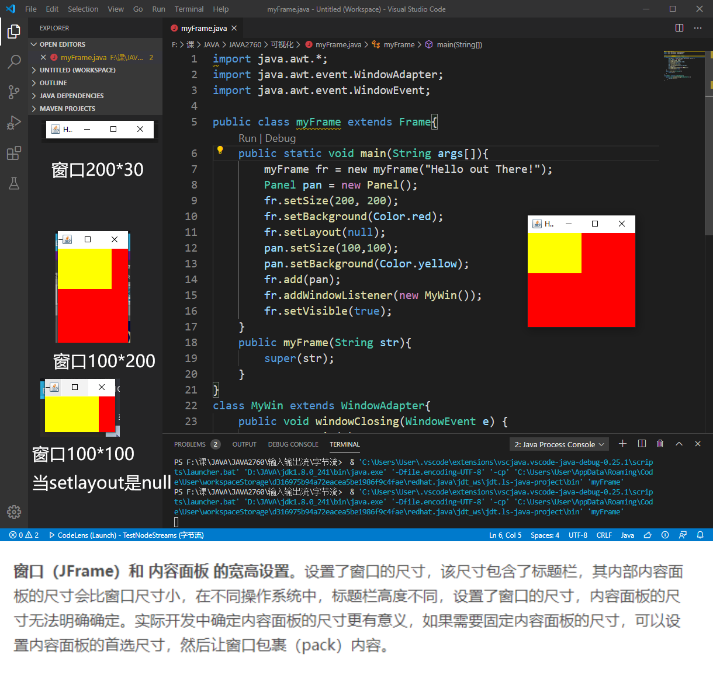

### 问题
myFrame.java中，窗口大小设置为200*200，面板大小为100*100，会发现纵向比例并不是2：1，有的电脑甚至横向比例也不是2：1。

### 原因
1. 窗口坐标的起始位置(0,0)在严格的左上角而非标题栏下面，所以纵向看起来不是2：1是因为有一部分被标题栏遮挡
2. **标题栏大小每个系统不一样！**所以有的电脑上看起来比例还好，有的严重不符。
3. 横向不对的原因：**setlayout为null时，如果横向窗口宽度比系统标题栏的默认宽度还要小，窗口宽度会被强制定为标题栏宽度**，如上图所示，我尝试了不同横向宽度的窗口大小发现了这一点。**因此横向不对的时候，实际上是系统认为这个窗口太窄了，强制拉宽了**，而此时因为面板大小是固定的，setlayout是null，面板大小不变，因此横向比例失真。
### 参考
https://blog.csdn.net/xietansheng/article/details/78389183