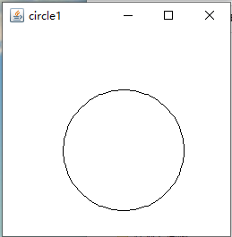

# Java可视化画圆
总的来说，画圆是用geom或者Graphic或者shape这样的图形库，然后把圆加到Frame里可视化；而要想把圆画得更圆，就要做平滑处理。
## Graphics
&emsp;&emsp;最基础的方法是用awt中的Graphics中的drawOval函数画圆。  
```java
void java.awt.Graphics.drawOval(int x, int y, int width, int height)
```
&emsp;&emsp;因为Graphics中椭圆被视为和矩形类似的，所以这里x、y不是焦点之类的，而是椭圆外接矩形的左上角坐标，width是横轴长，height是纵轴长。  
&emsp;&emsp;至于实现可视化的方法，是写一个继承Component的子类myComp，重载它的paint()函数，这样把myComp加入一个Frame中后，显示Frame的时候会自动调用myComp的paint()。（利用Graphics和Graphics2D其实绘图大致都是这样的。）  
&emsp;&emsp;Graphics并不支持平滑处理，所以画出来的圆略显粗糙。  

```java
class myComp extends Component{
    @Override
    public void paint(Graphics g){}
}
...
Frame f = new Frame();
f.add(new myComp());
f.setVisible(true);
```
## geom.Ellipse2D
&emsp;&emsp;drawOval用起来算坐标其实很不方便，可以使用java.awt.geom中的Ellipse2D构造，这样做的好处是它提供一个setFrameFromCenter方法[[1]](#1)，可以用中心点和一个边界点构造——对于圆来说，就是确定圆心$O(x,y)$和半径$r$，另外点就可以用$O^{'}(x+r,y+r)$表示——这样更自然一些.
```java
void java.awt.geom.RectangularShape.setFrameFromCenter(double centerX, double centerY, double cornerX, double cornerY)
```
## Graphics2D
&emsp;&emsp;Graphics2D是对Graphics的升级，调用方法基本一致，除了需要在paint重载的时候要把Graphics类型参数转换成Graphics2D类型，Graphics2D.drawOval、Ecllipse2D在没有任何调节的时候，和Graphics是一样粗糙的。  
  
## 抗锯齿
&emsp;&emsp;用Graphics2D的好处在于它有调节平滑参数的方法[[2]](#2)，可以把圆画的足够光滑，足够“圆”。  
```java
void java.awt.Graphics2D.setRenderingHint(Key hintKey, Object hintValue)
```
&emsp;&emsp;这里hintKey是已经写好的数据类型，用于控制对不同对象的光滑处理，比如KEY_ANTIALIASING是反锯齿的，	KEY_COLOR_RENDERING是控制颜色渲染等等；hintValue则是Key中可选的模式，比如ON、OFF、DEFAULT等等。  
&emsp;&emsp;对一般形状最管用的效果是反锯齿，加完之后是这样的：  
  
&emsp;&emsp;如果对这个还不满意，有一个投机取巧的方法是加粗线条(**Stroke**)，光滑处理效果虽然没变，但线条加粗了像素多了，锯齿就会弱一些,而且又可以调用setRenderingHint调节线条光滑度。  

## javafx
&emsp;&emsp;如果又想省力又想效果好，通常最好的方法就是使用一个新的工具。使用新的可视化包javafx中的javafx.scene.shape.Circle，一样可以画圆，而且十分简便[[3]](#3)：  
1. 直接可以设定圆心和半径
```java
circle.setCenterX(100.0f);
circle.setCenterY(100.0f);
circle.setRadius(75.0f);
```
2. 就像office里的形状一样有边框和填充，设置很方便
```java
circle.setFill(Color.TRANSPARENT);
circle.setStroke(Color.BLACK);
```
3. setSmooth即可自动调节平滑，而且默认平滑处理是开的
```java
circle.setSmooth(true);
```
4. 可以加一些特效，比如阴影，这样也能让圆“看起来”“更圆”。  
对比javafx和graphics2D，会发现实际上它们的平滑效果是差不多的，但在实际应用中，一般用到的都是实心的圆形，javafx的smooth再加上一些如阴影的效果，已经基本满足视觉效果了。  
  
## 参考 
<span id = "1">
[1]: （美）凯 S.霍斯特曼.Java核心技术 卷I 基础知识（原书第十版）[M].北京：机械工业出版社，2016.424-425.
</span> 
<span id = "2">  

[2]: https://blog.csdn.net/u011217199/article/details/78861531  - Graphics2d消除锯齿整理 - 逆境造就成功
</span>  
<span id = "3">  

[3]: https://www.w3cschool.cn/java/javafx-rectangle.html - JavaFX 矩形椭圆 - w3cschool
</span>