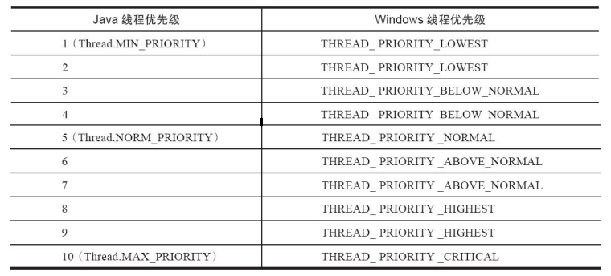
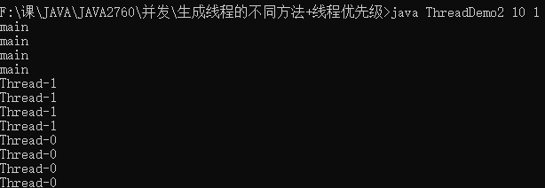
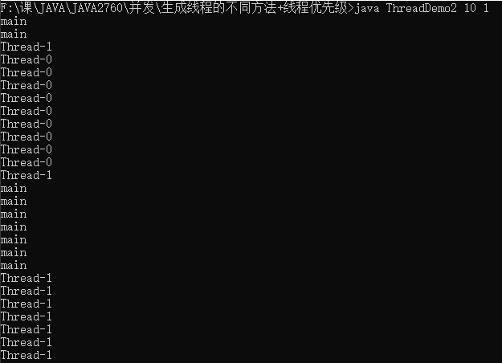

## ThreadDemo.java分析
## Java线程实现
Thread类很多方法是Native的，因此与系统有关。  
```java
    public static native void yield(); 
```   
实现线程有三种方法：内核线程(轻量级进程LWP)/用户线程/用户线程+LWP，windowsNT和linux主要都是LWP。  
不同jdk标准不一样，Sun jdk中windows和linux版都是一条Java线程映射到一条LWP.
## 线程调度策略
Java线程的唤醒、优先级设置是由JVM实现的，但线程的调度（与LWP的连接）则是由本地线程库完成。  
协同式调度：一个线程运行完了才运行下一个，一个线程卡死就完蛋了  
抢占式调度：FIFO算法，时间片轮转调度算法，优先级调度算法

## 线程的优先级规则
1. 线程的优先级具有**继承性**,也就是如果线程A启动线程B,那么线程A和B的优先级是一样的。
2. main的默认线程是5，此程序如果运行时不加入参数，则三个线程默认优先级均为5
3. 使用setPriority时无视继承性，直接改变优先级。至少用getPriority时，main，Thread-0，Thread-1的优先级都会是输入的数值。jvm和windows优先级对应:
>线程优先级并不是一项稳定的调节手段，优先级可能会被系统自行改变。Windows系统中存在一个叫“优先级推进器”的功能（Priority Boosting，当然它可以被关掉），大致作用是当系统发现一个线程被执行得特别频繁时，可能会越过线程优先级去为它分配执行时间，从而减少因为线程频繁切换而带来的性能损耗。   

1. 优先级高不代表独占，只是相比于低优先级线程有更大机率会获得时间片，java线程运行顺序时有随机性的。
**综上，下面的结果只是在我的电脑上出现次数比较多的情况，并不是一定的。**
## Synchronized关键字
静态compute方法有Synchronized关键字，这会保证**同一时间只有一个线程调用compute**，而且**不管sleep了多久，计算时间多长，均不会切换线程**,sleep()过程中不会失去锁，对此javase8的文档中有说明：
>The thread does not lose ownership of any monitors.
在for循环前，for循环和sleep之间，以及sleep之后，均添加了输出，且调用system.out.flush避免输出流不及时输出。  此时无论如何修改compute()的计算量和sleep时长，每次compute过程内都不会发生切换，结果类似这样：
>Thread-0: 1start  
Thread-0: 1sleep  
Thread-0: 1end

## 为什么我的win10上总是main先运行compute()
这三个线程调用的顺序是：
```java
t1.start();
t2.start();
for(int i=1; i<5; i++)  compute();
```
三个线程都在第一次调用compute()前加入输出（即三个调用compute的for循环中），结果几乎都是：
>main ready for compute  
main: 1start  
Thread-1 ready for compute  
Thread-0 ready for compute  

同样的代码放到Linux上，如果Thread-0的优先级如何（因为第一次调用应该没有什么切换问题），多跑几次就会出现：  
>Thread-0 ready for compute  
Thread-0: 1start  
main ready for compute  
Thread-1 ready for compute

我看了一下类定义，虽然Thread.start()不是native方法，但里面调用的start0是，因此windows和Linux的差异无非两种可能：  
1. Windows上JVM的Thread.start()太慢了...
2. 因为Windows是PC，六核的CPU，而Linux是单核服务器，有可能是自动并行，在两个线程start同时开始后面的操作导致main最先调用同步块
## Win10单核与多核的区别
为了验证前面两种可能性，需要用我win10电脑的一个核跑。查了很久发现可能JVM并没有直接控制CPU个数的调参，StackExchange的[这个回答](https://serverfault.com/questions/698617/java-limit-the-number-of-cores-a-jvm-can-use)说JVM实际上会用它能获得到的所以CPU，那么只需要从win10的限定进程使用的CPU即可,具体操作也很简单，别用VScode直接用cmd运行，限制cmd的核数，任务管理器里找到当前的cmd，右键->详细信息->右键设置相关性即可。结果如下：    
多核绝大多数情况是main先进入compute，单核时看优先级：  
1. Thread-0>main时Thread-0先，
2. Thread-1>Thread-0>main时Thread-1先，
3. 其余情况均位main先。  
   
单核时既有可能是高优先级的线程先进入，也有可能是main先进入，说明两种假设均是影响因素。

## compute()中最后的一次yield()
#### **Thread.yield()写在同步静态方法基本上没有用**。
官方文档中明确提到，yield可以被系统的任务管理器忽略，因此使用前需要反复调试以确保起作用。yield本身就不是确定的线程切换，因为一个线程yield之后是和所有线程一起抢时间片。  
所以在静态同步方法compute()中，即使当前线程调用yield，因为持有锁，其他线程都进不来，最终还是当前线程继续运行，线程调度只会发生在方法结束后，此时yield已经不发挥作用了。  
#### 解决办法：在run方法而非compute()方法内使用yield
在Linux上的运行结果会出现优先级最高的Thread-0没有被优先执行，就是因为yield被忽略的原因，如果在run方法中添加yield就可以和优先级较为一致了。
注意这里是仅仅在优先级别低的线程里添加yield，如果三个都加yield，linux和单核win10均会频繁的切换线程，这又不是我们想要的结果了。

## 反常运行结果分析
原程序的yield并不起作用，加之多核处理器的调度策略，实际运行时没有进程切换是正常的。
所谓反常结果，是win10多核时出现线程优先级最高的Thread-0最后跑，而且也没有发生线程切换：

#### 这还是JVM的线程调度服从win10线程调度导致的。  
事实上**win10单核的运行结果十分理想**，确实就是严格按照谁优先级最高谁会连续执行。  
**因此可以合理推测，win10在多核时会减少切换，增大时间片**，毕竟多核时可以并行不需要频繁切换，每个线程自然可以多跑一会，然而这个程序使用了静态同步方法，所以3个线程虽然都能分配到一个核，但是运行不了，而优先级低线程如果最先抢到compute的锁，运行一次compute之后时间片没用完，就会继续下去。（而且有可能win10会用Priority Boosting之类的方法修改优先级。）  
验证这个推测有两个方法：
1. 增加计算量，增加compute()计算次数和单次运行时间。前文的结果是$10^7$次循环100ms睡眠情况下的。修改为$2\times10^7$次循环和2000ms睡眠，少数情况会出现按优先级调度

2. 减少核数到2个。程序里一共有三个线程，如果只有两个核就会需要调度。**事实上，两个核运行时，即使是小规模的计算和休眠就经常会出现明显符合优先级的线程调度**，如下图，即使最先“抢到”compute的不是优先级最高的Thread-0，一段时间后还是会有限Thread-0运行，说明推测还是有道理的。

## 新版jdk会有变化吗
我在win10上尝试了Oracle Java SE14的发行版和openjdk的Reference Implementations版，与所有上文提到的结果基本一致
## 小节
Thread很多方法对系统有依赖性，需要具体分析，线程切换不是确定的，优先级、yield方法不能保证可以起作用。  
1. 需要某个线程必须先运行：join方法/加锁/让其他线程都等待直到被该线程唤醒  
2. 需要某个线程优先运行：设定优先级，优先级低的线程run时，更多次调用yield或调用更长时间的sleep，同时高优先级进程减少yield和sleep

## 参考
[1]深入理解Java虚拟机：JVM高级特性与最佳实践  
[2][Java SE8文档](https://docs.oracle.com/javase/8/docs/api/java/lang/Thread.html)

## Thread.yield()
<span id = "n1"></span>
>public static void yield()  
>
>A hint to the scheduler that the current thread is willing to yield its current use of a processor. The scheduler is free to ignore this hint.  
>  
>Yield is a heuristic attempt to improve relative progression between threads that would otherwise over-utilise a CPU. Its use should be combined with detailed profiling and benchmarking to ensure that it actually has the desired effect.
>
>It is rarely appropriate to use this method. It may be useful for debugging or testing purposes, where it may help to reproduce bugs due to race conditions. It may also be useful when designing concurrency control constructs such as the ones in the java.util.concurrent.locks package.
